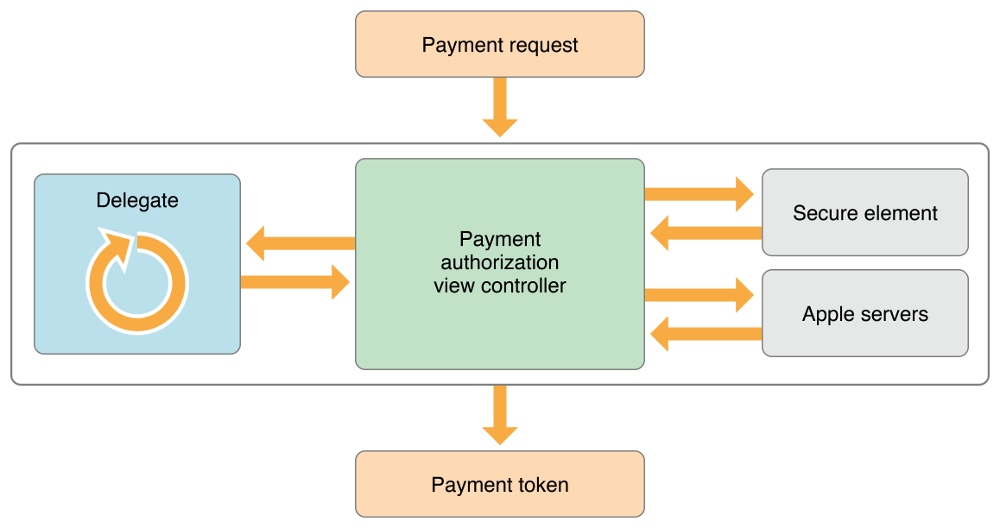

# 关于 Apple Pay
Apple Pay 是一项可以让用户安全便捷地为现实世界的物品或服务提供支付信息的移动支付技术。

应用中数字物品或者服务的支付请参考 [《In-App 支付编程指南》](https://developer.apple.com/library/ios/documentation/NetworkingInternet/Conceptual/StoreKitGuide/Introduction.html#//apple_ref/doc/uid/TP40008267)

使用 Apple Pay 的应用需要在 Xcode 中启用 Apple Pay 功能。首先，你需要注册一个商家 ID 并生成一个加密密钥。这个密钥用于加密发送至服务器的支付信息。

你的应用创建一个支付请求并初始化支付环境。这个支付请求包括了所支付的商品或者服务的小计、额外的税、运费或折扣的信息。将这个请求发送给给支付认证视图控制器 (Payment authorization view controller)。该视图控制器将该支付请求展示给用户并提示用户输入所需的必要信息，例如配送地址或者账单寄送地址等。当用户与视图控制器交互时，你的委托 (Delegate) 会被调用以更新该支付请求。

当用户授权支付后，Apple Pay 会加密支付信息以防止非授权第三方访问该信息。在设备上，Apple Pay 将支付请求会送至安全模块 （Secure element）处理。安全模块是位于用户设备上的一个专用芯片。它使用
你的商家信息、支付数据以及所使用的银行卡进行计算，生成一个加密支付令牌。随后，安全模块会将该令牌发送至 Apple 的服务器。此服务器会使用你的商家 ID 对应的 证书重新加密支付令牌。最后，服务器将它发送至应用处理。

支付令牌不会被存储于 Apple  的服务器上，服务器只是简单地使用你的证书重新加密你的支付令牌。这样一个支付过程使得无需将商家 ID 对应的证书随着应用一起发布，同时可以保证应用程序可以安全地加密用户的支付信息。

关于 Apple Pay 的安全性的更多内容请参考 [《iOS 安全性指南》](https://www.apple.com/business/docs/iOS_Security_Guide.pdf)

绝大多数情况下，你的应用程序会将加密后的支付令牌发送至第三方的支付平台以完成支付过程。然而，如果你的团队有自己的支付平台，你可以在自己的服务器上解密然后处理自己的支付业务。

关于支持 Apple Pay 的支付平台的更多内容请参考 [developer.apple.com/apple-pay/.](https://developer.apple.com/apple-pay/)。

