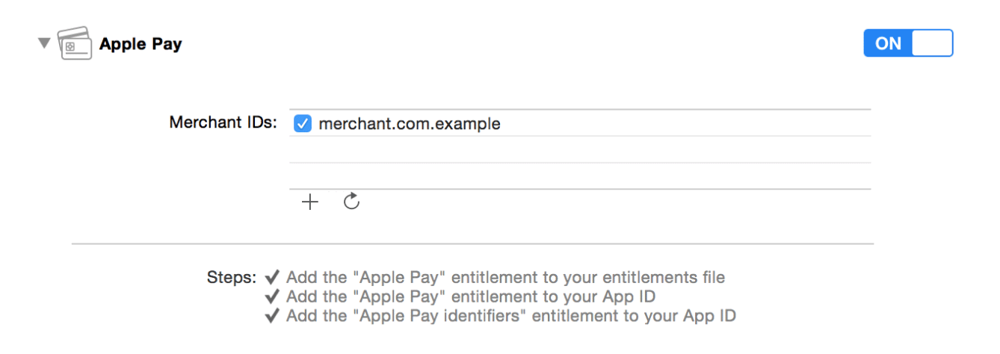

# 配置你的开发环境

Apple Pay 中的商家 ID 用于标识你能够接受付款。与商家 ID 相关联的公钥与证书用于在支付过程中加密支付信息。要想使用 Apple Pay，你首先需要注册一个商家 ID 并且配置它的证书。

## 注册商家 ID

 1. 在开发者中心选择[证书、标识符及描述文件](https://developer.apple.com/account/ios/identifiers/merchant/merchantLanding.action)。
 2. 在标识符下选择商家 ID。
 3. 点击右上角的添加按钮(+)。
 4. 输入描述与和标识符，然后继续。
 5. 检查设置然后点击注册。
 6. 点击完成。
 
## 为商家 ID 配置证书
 1. 在开发者中心选择[证书、标识符 及描述文件](https://developer.apple.com/account/ios/identifiers/merchant/merchantLanding.action)。
 2. 在标识符下选择商家 ID。
 3. 从列表中选择商家 ID，点击编辑。
 4. 点击创建证书， 根据提示生成你的证书签名请求（CSR），然后点击继续。
 5. 点击选择文件，选择你的 CSR，然后点击生成。
 6. 点击下载证书，然后点击完成。

如果你在钥匙串访问 (Keychain Access) 看到警告信息：该证书由一个未知的机构签发或者该证书有一个无效的发行人，请将 WWDR 中间证书 - G2 以及 Apple 的根证书 - G2 安装到你的钥匙串中。你可以在 [apple.com/certificateauthority](https://www.apple.com/certificateauthority/) 下载到这两个证书。

在 Xcode 的 capabilities 面板中为应用启用 Apple Pay 功能。在 Apple Pay 这一行中点击开启，然后指定该应用使用的商家 ID 即可。

 
> 注意：
> > 在故障排除过程中，手动的启动 Apple Pay 会让工作更容易。下面的步骤可以手动启用 Apple Pay：
 > > 1. 在开发者中心选择[证书、标识符 及调置](https://developer.apple.com/account/ios/identifiers/merchant/merchantLanding.action)。
 > > 2. 在标识符下选择应用 ID。
 > > 3. 从列表中选择应用 ID，然后点击编辑。
 > > 4. 选择 Apple Pay，然后点击编辑。
 > > 5. 选择你使用的商家 ID，然后点击继续。
 > > 6. 查看设置，然后点击分配 (Assign)。
 > > 7. 点击完成。
    