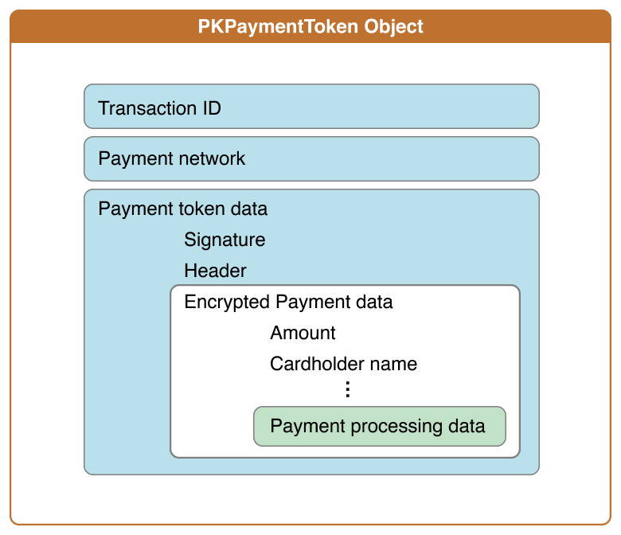

# 处理支付

处理一次付款事务一般包括以下几个步骤：

 1. 将付款信息与其它处理订单的必需信息一起发送至你的服务器。
 2. 验证付款数据的散列值与签名。
 3. 解密出支付数据。
 4. 将支付数据提交给付款处理网络。
 5. 将订单信息提交至你的订单跟踪系统。
 
你有两种可选的方式处理付款过程：1) 利用已有的支付平台来处理付款。2) 自己实现付款过程。一次付款的处理过程通常情况下包括上述的大部分步骤。

访问、验证以及处理付款信息都需要你懂得一些加密领域的知识，比如 SHA-1 哈希、访问和验证 PKCS #7 签名以及如何实现椭圆曲线 Diiffie-Hellman 密钥交换等。如果你没有这些加密的背景知识，我们建议你使用已有支付平台，它们会替你完成这些繁琐的操作。关于 Apple Pay 已支持的第三方支付平台，请参考 [developer.apple.com/apple-pay/.](https://developer.apple.com/apple-pay/)。

如图 5-1 所示，付款数据是嵌套结构。支付令牌是 [PKPaymentToken](https://developer.apple.com/library/ios/documentation/PassKit/Reference/PKPaymentToken_Ref/index.html#//apple_ref/occ/cl/PKPaymentToken) 类的实例。其 paymentData 属性值是一个 JSON 字典。该 JSON 字典包括用于验证信息有效性头信息以及加密后的付款数据。加密后的支付数据包括付款金额、持卡人姓名以及其它特定支付处理协议的信息。

图 5-1 付款数据的数据结构

更多关于付款数据的数据结构，请参考[支付令牌的格式](https://developer.apple.com/library/ios/documentation/PassKit/Reference/PaymentTokenJSON/PaymentTokenJSON.html#//apple_ref/doc/uid/TP40014929)。

